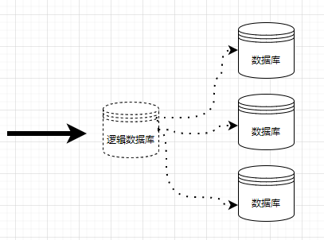
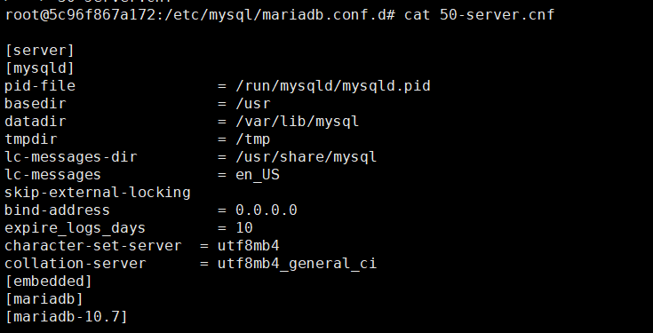
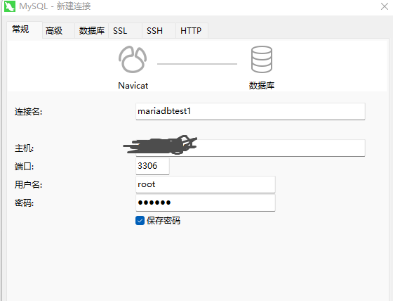
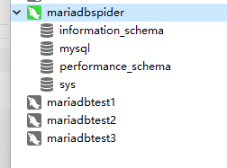
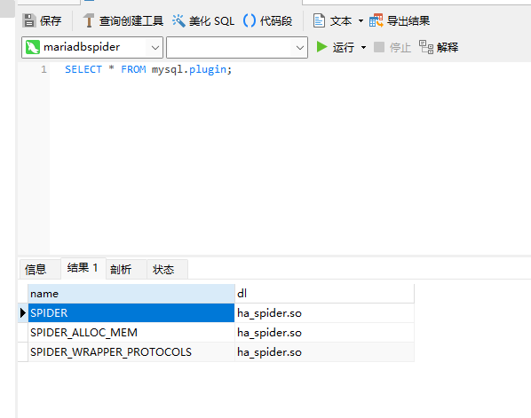
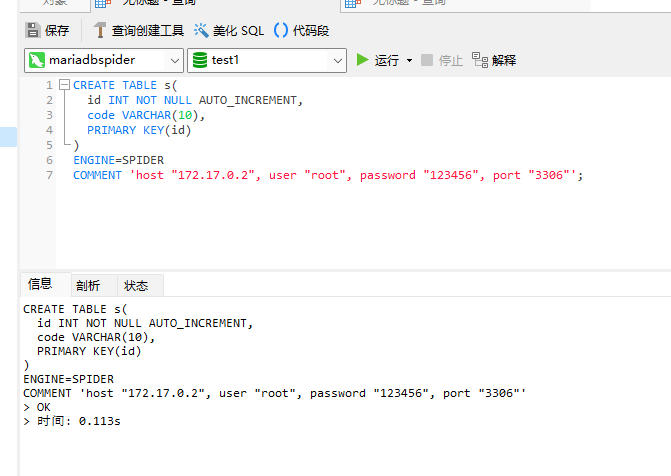
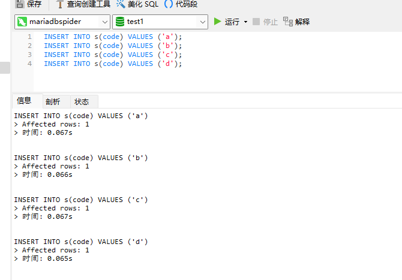
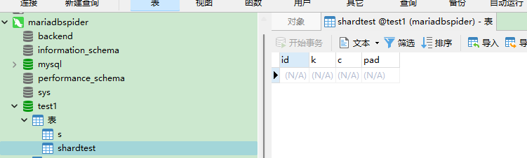

### 分库分表

一般来说，数据库分库分表，有以下做法：

* 按哈希分片：根据一条数据的标识计算哈希值，将其分配到特定的数据库引擎中；

* 按范围分片：根据一条数据的标识（一般是值），将其分配到特定的数据库引擎中；

* 按列表分片：根据某些字段的标识，如果符合条件则分配到特定的数据库引擎中。


分库分表的做法有很多种，例如编写代码库，在程序中支持多数据库，程序需要知道每个数据库的地址，并要编写代码进行支持；使用中间件将多个数据库引擎连接起来，程序只需要知道中间件地址。

但是分库分表后，因为任意两个表可能在不同的数据库实例中，两个表进行连接查询时，两个数据库实例之间的交互变得复杂起来，当集群中的数据量较大时，便不能随意 `join` 了，可能需要其他方式支撑聚合查询。


分库分表有优点有缺点，这里就不再多说，先学会再打算。


MariaDB Server 是开源的，目前最流行的关系型数据库之一，MariaDB 是从 Mysql 的分支开发而来，一直保持对 Mysql 的兼容性。因为甲骨文的收购，MySQL 属于 Oracle 所有，存在闭源的可能，以及逐渐商业化，变得不清真，于是 Mysql之父创建了 MariaDB，目的是完全兼容 Mysql，并且开源、免费。

MariaDB 使用 Spider 插件进行分库分表的支持，Spider 存储引擎是一个内置分片功能的存储引擎。它支持分区和xa 事务，并允许处理不同 MariaDB 实例的表，就好像它们在同一个实例上一样。

> 请参考资料：[https://mariadb.com/kb/en/spider/](https://mariadb.com/kb/en/spider/)


在这篇文章中，笔者将使用 MariaDB Spider 进行分库分表的实践。


### 部署 **MariaDB** 实例

为了更好地创建分库分表实践环境，这里需要三个 “物理”数据库，一个逻辑数据库，即四个 MariaDB 实例。MariaDB 实际占用的内存并不大，笔者 4G 内存的服务器装了 Kubernetes ，用 Docker 部署四个 MariaDB 数据库，运行速度正常，对于我们测试练习 4G 内存足以。

四个数据库的关系如图：



其中，逻辑数据库实例称为 Spider Proxy Node，实际存储数据的数据库实例被称为 Backend Node。

典型的 Spider 部署具有无共享的集群架构。该系统适用于任何廉价的硬件，并且对硬件或软件的特定要求最低。它由一组计算机组成，具有一个或多个 MariaDB 进程，称为节点。

存储数据的节点将被设计为`Backend Nodes`，并且可以是**任何 MariaDB、MySQL、Oracle 服务器实例**，使用后端内可用的任何存储引擎。


#### Docker 部署

如果机器不够，使用虚拟机部署便会显得很麻烦，这里笔者使用 Docker 快速部署练习。

参考资料：[https://mariadb.com/kb/en/installing-and-using-mariadb-via-docker/](https://mariadb.com/kb/en/installing-and-using-mariadb-via-docker/)

查看 MariaDB 镜像版本列表：[https://hub.docker.com/_/mariadb/](https://hub.docker.com/_/mariadb/)


直接创建四个数据库实例，其中一个是 Spider 实例，实例使用端口区分。

```bash
docker run --name mariadbtest1 -e MYSQL_ROOT_PASSWORD=123456 -p 13306:3306 -d docker.io/library/mariadb:10.7

docker run --name mariadbtest2 -e MYSQL_ROOT_PASSWORD=123456 -p 13307:3306 -d docker.io/library/mariadb:10.7

docker run --name mariadbtest3 -e MYSQL_ROOT_PASSWORD=123456 -p 13308:3306 -d docker.io/library/mariadb:10.7

docker run --name mariadbspider -e MYSQL_ROOT_PASSWORD=123456 -p 13309:3306 -d docker.io/library/mariadb:10.7
```


接着，进入每个容器实例中，进入 `/etc/mysql/mariadb.conf.d` 目录，修改`50-server.cnf`文件，运行远程访问数据库实例。由于容器中没有 nano、vi  这些编辑命令，因此可以使用下面的命令快速替换文件内容：

```bash
echo '
[server]
[mysqld]
pid-file                = /run/mysqld/mysqld.pid
basedir                 = /usr
datadir                 = /var/lib/mysql
tmpdir                  = /tmp
lc-messages-dir         = /usr/share/mysql
lc-messages             = en_US
skip-external-locking
bind-address            = 0.0.0.0
expire_logs_days        = 10
character-set-server  = utf8mb4
collation-server      = utf8mb4_general_ci
[embedded]
[mariadb]
[mariadb-10.7]
' > 50-server.cnf
```




然后查看每个容器的主机内 IP：

```bash
docker inspect --format='{{.NetworkSettings.IPAddress}}' mariadbtest1 mariadbtest2 mariadbtest3 mariadbspider
```

```
172.17.0.2
172.17.0.3
172.17.0.4
172.17.0.5
```


接着打开名为 mariadbspider 的容器，在里面按照 Spider 插件：

```bash
apt update
apt install mariadb-plugin-spider
```


#### 虚拟机部署

这里需要四个虚拟机，每个虚拟机都需要先安装 MariaDB 数据库引擎以及一些工具包。

可参考：[https://mariadb.com/kb/en/spider-installation/](https://mariadb.com/kb/en/spider-installation/)


**首先在每个虚拟安装 MariaDB Community Server，即数据库引擎。**


如果使用虚拟机部署安装，需要替换国内镜像源，以便快速下载需要的包， Centos 服务器，可以直接以下命令快速更新镜像源，如果是 Debain 系列，可自行查找对应的镜像源。

```bash
wget -O /etc/yum.repos.d/CentOS-Base.repo http://mirrors.aliyun.com/repo/Centos-7.repo
#清除缓存
yum clean all
#生成新的缓存
yum makecache
```


接着，配置 MariaDB 官方的软件包存储库：

```bash
sudo yum install wget
wget https://downloads.mariadb.com/MariaDB/mariadb_repo_setup
echo "fd3f41eefff54ce144c932100f9e0f9b1d181e0edd86a6f6b8f2a0212100c32c mariadb_repo_setup" | sha256sum -c -
chmod +x mariadb_repo_setup
sudo ./mariadb_repo_setup --mariadb-server-version="mariadb-10.7"
```

再次更新镜像源缓存：

```bash
#清除缓存
yum clean all
#生成新的缓存
yum makecache
```


安装 MariaDB 社区服务器和软件包依赖项：

```bash
sudo yum install MariaDB-server MariaDB-backup
```


接着，配置允许远程访问数据库。

MariaDB 的配置文件都在 `/etc/my.cnf` 中，打开 `/etc/my.cnf.d/`  目录后，修改 `server.cnf` 文件，允许远程访问。找到 `bind-address`  属性，去掉 `#` 。

```bash
#bind-address=0.0.0.0
↓
bind-address=0.0.0.0
```

如需了解每个配置的作用，请参考资料： [https://mariadb.com/docs/deploy/community-spider/#configuration](https://mariadb.com/docs/deploy/community-spider/#configuration)


**修改密码。**因为裸机部署的数据库，本身没有密码，所以需要手动配置。

打开终端，执行以下命令：

```bash
mysql -u root -p
```

```bash
set password for root @localhost = password('123456');
```

然后执行 `quit;` 退出数据库操作终端。


> 如果提示 root 不存在，则请使用 `mysql -u mysql -p` ，密码为空，直接按下回车键即可。如果不行，则参考：[https://www.whuanle.cn/archives/1385](https://www.whuanle.cn/archives/1385)


然后重启数据库实例：

```bash
systemctl restart mariadb
systemctl status mariadb
```

> 接着检查防火墙配置，或执行 `sudo iptables -F` 清理防火墙配置。


### MariaDB 配置

MariaDB 配置文件中，部分主要属性的说明如下如下：

| **字段**        | **说明**                                        |
| --------------- | ----------------------------------------------- |
| bind_address    | 绑定访问地址                                    |
| max_connections | 最大连接数                                      |
| thread_handling | 设置 MariaDB 社区服务器如何处理客户端连接的线程 |
| log_error       | 错误日志输出文件                                |

 

MariaDB 基础维护命令：

| 说明           | **命令**                        |
| -------------- | ------------------------------- |
| 启动           | sudo systemctl start  mariadb   |
| 停止           | sudo systemctl stop  mariadb    |
| 重新启动       | sudo systemctl restart  mariadb |
| 在启动期间启用 | sudo systemctl enable  mariadb  |
| 启动时禁用     | sudo systemctl disable  mariadb |
| 状态           | sudo systemctl status  mariadb  |


### 检查每个实例

部署数据库后，需要连接每个数据库进行测试，以便检查数据库是否正常。







### 配置 Spider

打开 mariadbspider 数据库实例，执行以下命令，加载 spider 插件，将其设置为 Spider  数据库实例。

```sql
INSTALL SONAME 'ha_spider';
```
> 执行命令查询是否已经启动 Spider 插件：
>
> ```bash
> SELECT * FROM mysql.plugin;
> ```

> 
>
> 请参考资料：[https://mariadb.com/kb/en/spider-installation/](https://mariadb.com/kb/en/spider-installation/)


### 远程表

MariaDB Spider 模式已经搭建好了，这里开始进行实践。

在这个模式中，**Spider 中的一个表对应一个数据库实例中的同名数据库的同名表**，即数据库名称系统，表名称相同。

首先在 三个数据库实例中，创建一个测试数据库，名称为 test1 ，然后执行命令创建表：

```sql
CREATE TABLE s(
  id INT NOT NULL AUTO_INCREMENT,
  code VARCHAR(10),
  PRIMARY KEY(id));
```


然后再 mariadbspider 实例中，执行命令，创建逻辑表，并将这个表绑定到 mariadbtest1 实例中。

```sql
CREATE TABLE s(
  id INT NOT NULL AUTO_INCREMENT,
  code VARCHAR(10),
  PRIMARY KEY(id)
)
ENGINE=SPIDER 
COMMENT 'host "172.17.0.2", user "root", password "123456", port "3306"';
```

> 注意替换你的 IP，另外注意端口，如果是容器访问容器，直接使用 3306。



> 如果没有配置好，数据库不对应等，可能会出现：
> ```
> > 1046 - No database selected
> > 时间: 0.062s
> ```


然后在 mariadbspider 中，插入四条数据：

```sql
INSERT INTO s(code) VALUES ('a');
INSERT INTO s(code) VALUES ('b');
INSERT INTO s(code) VALUES ('c');
INSERT INTO s(code) VALUES ('d');
```



如果分别打开三个实例，你会发现，插入的数据只会出现在 mariadbtest1 中出现，因为这个表只绑定了它。你还可以在 mariadbspider 上对这个表进行增删查改，所有操作都会同步到对应数据库实例中。


### 基准性能测试

SysBench 是一个模块化、跨平台和多线程的基准测试工具，支持 Windows 和 Linux，用于评估对于在高负载下运行数据库的系统非常重要的操作系统参数。这个基准测试套件的想法是，在不设置复杂的数据库基准或甚至根本不安装数据库的情况下，快速获得系统性能的印象。它可以测试出：

* 文件 i/o 性能 
* 调度器性能
* 内存分配和传输速度
* POSIX 线程实现性能
* 数据库服务器性能(OLTP 基准)

项目地址：[https://github.com/akopytov/sysbench](https://github.com/akopytov/sysbench)

Linux 可以直接安装二进制包。

- Debian/Ubuntu

  ```
  curl -s https://packagecloud.io/install/repositories/akopytov/sysbench/script.deb.sh | sudo bash
  sudo apt -y install sysbench
  ```

- RHEL/CentOS:

  ```
  curl -s https://packagecloud.io/install/repositories/akopytov/sysbench/script.rpm.sh | sudo bash
  sudo yum -y install sysbench
  ```

- Fedora:

  ```
  curl -s https://packagecloud.io/install/repositories/akopytov/sysbench/script.rpm.sh | sudo bash	
  sudo dnf -y install sysbench
  ```

- Arch Linux:

  ```
  sudo pacman -Suy sysbench
  ```


sysbench 命令格式：

```bash
sysbench <TYPE> --threads=2 --report-interval=3 --histogram --time=50 --db-driver=mysql --mysql-host=<HOST> --mysql-db=<SCHEMA> --mysql-user=<USER> --mysql-password=<PASSWORD> run
```


首先，在当前特定数据库下创建模拟数据：

```bash
sysbench oltp_read_write --db-driver=mysql --mysql-user=root --mysql-password=123456 --mysql-host=123.123.123.123 --mysql-port=13309  --mysql-db=test1 prepare
```

```bash
sysbench 1.0.18 (using system LuaJIT 2.1.0-beta3)

Creating table 'sbtest1'...
Inserting 10000 records into 'sbtest1'
Creating a secondary index on 'sbtest1'...
```


接着运行测试：

```bash
sysbench oltp_read_write --db-driver=mysql --mysql-user=root --mysql-password=123456 --mysql-host=123.123.123.123 --mysql-port=13309  --mysql-db=test1 run
```

```bash
SQL statistics:
    queries performed:
        read:                            112
        write:                           32
        other:                           16
        total:                           160
    transactions:                        8      (0.80 per sec.)
    queries:                             160    (15.96 per sec.)
    ignored errors:                      0      (0.00 per sec.)
    reconnects:                          0      (0.00 per sec.)

General statistics:
    total time:                          10.0273s
    total number of events:              8

Latency (ms):
         min:                                 1244.02
         avg:                                 1253.36
         max:                                 1267.87
         95th percentile:                     1258.08
         sum:                                10026.85

Threads fairness:
    events (avg/stddev):           8.0000/0.00
    execution time (avg/stddev):   10.0269/0.00
```

> 或者每 3 秒生成一次直方图：
>
> ```bash
> sysbench oltp_read_write --threads=2 --report-interval=3 --histogram --time=50 --table-size=1000000 --db-driver=mysql --mysql-user=root --mysql-password=123456 --mysql-host=123.123.123.123 --mysql-port=13309  --mysql-db=test1 run
> ```


清理模拟生成的数据：

```bash
sysbench oltp_read_write --db-driver=mysql --mysql-user=root --mysql-password=123456 --mysql-host=123.123.123.123 --mysql-port=13309  --mysql-db=test1 cleanup
```


sysbench 跑测试时，可选参数如下：

- **使用`–time=<SECONDS>`**运行固定时间
- **使用`–events=0`**对执行的查询不设置限制
- **使用`–db-ps-mode=disable`**禁用准备好的语句
- **使用`–report-interval=<SECONDS>`**获取绘图点
- **用`--histogram`**得到一个直方图


sysbench 有三个过程或执行模式：

- `prepare`：为需要它们的测试执行准备操作，例如在磁盘上为`fileio` 测试创建必要的文件，或填充测试数据库以进行数据库基准测试。

- `run`：运行使用*testname* 参数指定的实际测试。此命令由所有测试提供。

- `cleanup`：在创建一个的测试中测试运行后删除临时数据。

  


> 你也可以参考笔者的另一篇文章，使用别的方法做基准测试：[https://www.whuanle.cn/archives/1388](https://www.whuanle.cn/archives/1388)


### 加入后端数据库

在远程表一节中，我们是在创建表的时候，再绑定一个数据库实例，其实也可以提前配置多个数据库实例到 Spider 中，下面是在  Spider 中执行的配置命令：

```sql
CREATE SERVER mariadbtest1 
  FOREIGN DATA WRAPPER mysql 
OPTIONS( 
  HOST '172.17.0.2', 
  DATABASE 'test1',
  USER 'root',
  PASSWORD '123456',
  PORT 3306
);

CREATE SERVER mariadbtest2 
  FOREIGN DATA WRAPPER mysql 
OPTIONS( 
  HOST '172.17.0.3', 
  DATABASE 'test1',
  USER 'root',
  PASSWORD '123456',
  PORT 3306
);

CREATE SERVER mariadbtest3 
  FOREIGN DATA WRAPPER mysql 
OPTIONS( 
  HOST '172.17.0.4', 
  DATABASE 'test1',
  USER 'root',
  PASSWORD '123456',
  PORT 3306
);
```


### 哈希分片

在这一小节中，我们将一个表进行分片，在插入数据时，数据自动分片到三个数据库实例中。

在三个数据节点数据库中，在 test1 数据库下，执行命令，创建表：

```sql
CREATE  TABLE shardtest
(
  id int(10) unsigned NOT NULL AUTO_INCREMENT,
  k int(10) unsigned NOT NULL DEFAULT '0',
  c char(120) NOT NULL DEFAULT '',
  pad char(60) NOT NULL DEFAULT '',
  PRIMARY KEY (id),
  KEY k (k)
)
```

> 此时，三个数据库实例都具有相同的表。


然后在 mariadbspider 实例中，执行命令，创建逻辑表，并将此表通过切片的模式，连接到三个数据库实例中。

```bash
CREATE TABLE test1.shardtest
(
  id int(10) unsigned NOT NULL AUTO_INCREMENT,
  k int(10) unsigned NOT NULL DEFAULT '0',
  c char(120) NOT NULL DEFAULT '',
  pad char(60) NOT NULL DEFAULT '',
  PRIMARY KEY (id),
  KEY k (k)
) ENGINE=spider COMMENT='wrapper "mysql", table "shardtest"'
 PARTITION BY KEY (id) 
(
 PARTITION pt1 COMMENT = 'srv "mariadbtest1"',
 PARTITION pt2 COMMENT = 'srv "mariadbtest2"',
 PARTITION pt3 COMMENT = 'srv "mariadbtest3"' 	
) ;
```




然后打开 https://github.com/whuanle/write_share_database，找到 `分片测试数据.sql` 这个文件，里面有很多模拟数据。


你可以观察到，三个数据库实例的数据是不同的。


### 根据值范围分片

分片方式的选择在于 `PARTITION BY` 属性，例如哈希分片是根据一个键进行计算的，则配置命令为 ` PARTITION BY KEY (id) `，如果是根据值范围分片，则是 ` PARTITION BY range columns (<字段名称>)`。

```bash
) ENGINE=spider COMMENT='wrapper "mysql", table "shardtest"'
 PARTITION BY range columns (k)
(
 PARTITION pt1 values less than (5000) COMMENT = 'srv "mariadbtest1"',
 PARTITION pt2 values less than (5100) COMMENT = 'srv "mariadbtest2"'
 PARTITION pt3 values less than (5200) COMMENT = 'srv "mariadbtest3"'
) ;
```


### 根据列表分片

根据列表分片，一般是某个字段，可以将数据划分为不同类型，可以根据这个字段的内容对数据进行分组。


```sql
) ENGINE=spider COMMENT='wrapper "mysql", table "shardtest"'
 PARTITION BY list columns (k)
(
 PARTITION pt1 values in ('4900', '4901', '4902') COMMENT = 'srv "mariadbtest1"',
 PARTITION pt2 values in ('5000', '5100') COMMENT = 'srv "mariadbtest2"'
 PARTITION pt3 values in ('5200', '5300') COMMENT = 'srv "mariadbtest3"'
) ;
```


当数据的 k 字段，值是 4900 、4901 或 4902 时，将被分片到 mariadbtest1 实例中。

